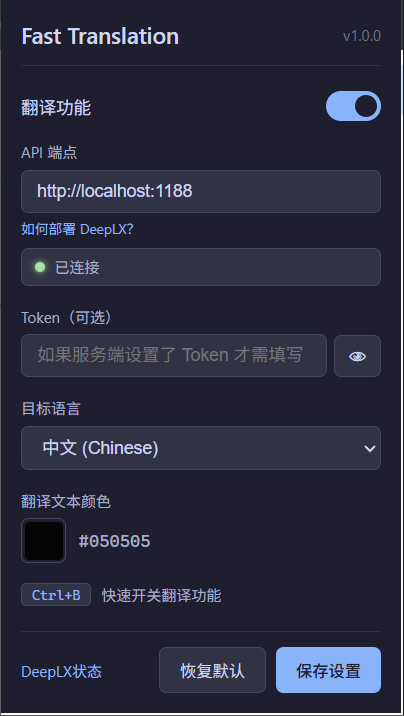
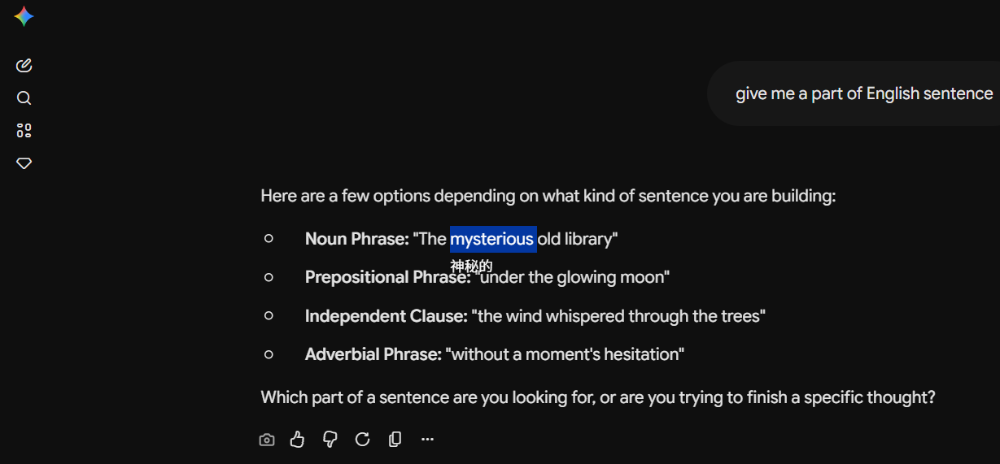
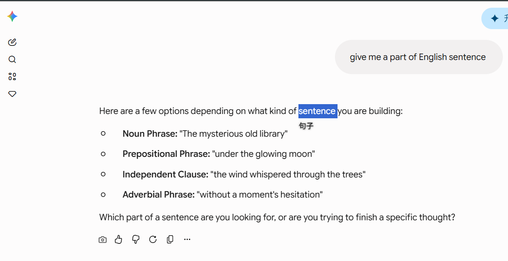

    # Fast Translation - Chrome/Edge 扩展

1. 选中文本后自动显示翻译结果，基于 DeepLX，感谢[ https://github.com/OwO-Netork/DeepLX](https://github.com/OwO-Netork/DeepLX) 开源；
2. 适合在与AI使用英文沟通的过程中，点击不清晰意译的词语进行快速翻译;
3. 可自定义翻译文本颜色，在各个主题背景中能够正常显示。

## 快速开始

### 1. 运行 DeepLX 翻译服务

**推荐方式** — 双击 `LaunchDeepLX.vbs`，静默启动无弹窗。

如需确认是否启动成功，双击 `LaunchDeepLX_Msg.vbs`，会弹出成功/失败提示。

服务默认监听 `http://localhost:1188`。

### 2. 安装扩展

1. 打开 Chrome，访问 `chrome://extensions/`
2. 开启右上角「开发者模式」
3. 点击「加载已解压的扩展程序」，选择本文件夹
4. **首次安装将自动弹出引导页**，检测服务状态并引导操作
5. **刷新已打开的网页**（F5），使内容脚本生效

### 3. 开机自启

双击 `设置开机自启.vbs`，自动在 Windows 启动文件夹创建快捷方式，下次开机 DeepLX 自动静默启动。

### 4. 使用

- 在任意网页上**选中文本**，翻译结果将自动显示在选中文字下方
- 翻译文本会跟随选中文字一起滚动，相对距离不变
- 按 `Esc` 关闭翻译提示
- 按 `Ctrl+B` 开关翻译功能
- 点击工具栏图标可进入设置弹窗，保存后自动关闭

## 设置选项

| 选项 | 说明 | 默认值 |
|------|------|--------|
| 翻译功能 | 开关翻译 | 开启 |
| API 端点 | DeepLX 服务地址 | `http://localhost:1188` |
| Token | 服务端鉴权 Token（可选） | 空 |
| 目标语言 | 翻译目标语言 | 中文 (ZH) |
| 文本颜色 | 翻译结果文字颜色 | `#ffffff` |

## 支持的语言

| 语言 | 代码 |
|------|------|
| 中文 | ZH |
| 英文 | EN |
| 法文 | FR |
| 俄文 | RU |
| 西班牙文 | ES |

## 翻译显示规则

1. 默认在选中文本下方，支持多行换行显示
2. 无文本框背景色，只显示文本
3. 文本颜色默认为白色，可在设置中修改
4. 翻译结果缓存于内存中（最多 200 条），重复选中即时返回
5. 翻译文本跟随选中文字滚动，相对距离不变

## 性能说明

翻译响应时间取决于 DeepLX 服务端处理速度（通常 0.6-1.4 秒）。客户端已做优化：

- 内容脚本直接请求 DeepLX，无 Service Worker 中转
- 内存缓存（最多 200 条），重复文本即时返回
- 无防抖延迟，松手即触发

## 技术栈

- Chrome Extension Manifest V3
- DeepLX（Go 语言，DeepL 免费 API 开源，[text](https://github.com/OwO-Netork/DeepLX)）
- 无第三方依赖